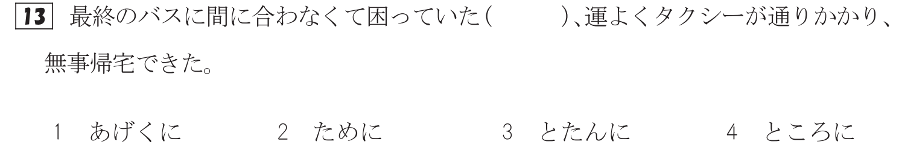
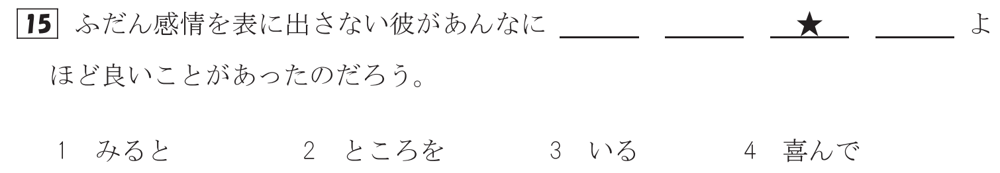

<p
                                                                ⣸       ⣸⢡⠣⡣⡛⢷⣄⣠⣠⣀⡀⣀⡤⢖⢫⢙⢿⡄⠀⠀⠀⠀⠀ ⠀⠀⠀⠀⠀⠀⠠⡗⢕⠕⡕⡱⡑⡕⡜⡔⢕⢍⢇⢎⢎⢪⠸⡘⡧⠀⠀⠀⠀⠀ ⠀⠀⠀⠀⣀⣴⢎⠎⡎⢎⢪⢊⢎⢪⣸⢼⣜⡔⡕⡜⡌⡎⢎⠪⡿⠀⠀⠀⠀⠀ ⠀⠀⢀⡾⠁⠉⠉⠛⠛⠓⠓⠓⠋⠉⠀⠀⠈⠙⠳⠮⣮⣼⣸⣘⣜⣤⡀⠀⠀⠀ ⠀⢠⡟⠀⠀⠀⠀⠀⠀⠀⠐⠀⠀⠀⠀⠀⠀⠒⠀⠀⠀⠀⠀⠀⠀⠀⠹⣆⠀⠀ ⠀⣾⠀⠀⠀⣠⢠⣀⠐⠚⠉⠃⠀⠀⠀⠀⠀⠒⠶⡄⠀⠀⠀⠀⠀⠀⠀⢹⡄⠀ ⠀⣷⠀⠀⠐⠃⢋⠊⠙⠁⠀⠀⣤⣠⣆⣀⠀⠀⠀⠰⢣⢮⢦⠄⠀⠀⠀⢸⡇⠀ ⠀⢻⡀⠀⠀⠀⠀⠀⠀⠀⠀⠀⠈⣏⢻⡇⠀⠀⠀⠀⠀⠀⠀⠀⠀⠀⠀⣸⠅⠀ ⠀⠈⢷⡀⠀⠀⠀⠀⠀⠀⠀⠀⠀⠉⣍⠀⠀⠀⠀⠀⠀⠀⠀⠀⠀⠀⢠⡏⠀⠀ ⠀⠀⠀⠙⣳⠄⠀⠀⠀⠀⠀⠀⠀⠀⠀⠀⠀⠀⠀⠀⠀⠀⠀⠀⠀⡴⠋⠀⠀⠀ ⠀⠀⠀⢸⣃⣠⡄⠀⠀⠀⠀⠀⠀⠀⠀⠀⠀⠀⠀⠀⠀⠀⠀⠀⠀⠓⣦⠀⠀⠀ ⠀⠀⠀⠀⠀⠘⣇⠀⠀⠀⠀⠀⠀⠀⠀⠀⠀⠀⠀⠀⠀⠀⠀⢠⠚⠦⠜⠃⠀⠀ ⠀⠀⠀⠀⠀⠀⠙⣦⠀⠀⠀⠀⠀⠀⠀⠀⠀⠀⠀⠀⠀⠀⣠⡞⡞⡫⡹⣆⠀⠀ ⠀⠀⠀⠀⠀⠀⠀⠈⠙⢦⣀⡀⠀⠀⠀⠀⠀⠀⠀⣀⡠⠖⠛⠪⠎⠞⠚⠁⠀⠀ ⠀⠀⠀⠀⠀⠀⠀⠀⠀⠀⠀⠉⠹⡄⢸⡄⢠⠏⠉⠁
>

This is a [Next.js](https://nextjs.org/) project bootstrapped with [`create-next-app`](https://github.com/vercel/next.js/tree/canary/packages/create-next-app).

## Getting Started

First, run the development server:

```bash
npm run dev
# or
yarn dev
# or
pnpm dev
# or
bun dev
```

Open [http://localhost:3000](http://localhost:3000) with your browser to see the result.

You can start editing the page by modifying `app/page.tsx`. The page auto-updates as you edit the file.

This project uses [`next/font`](https://nextjs.org/docs/basic-features/font-optimization) to automatically optimize and load Inter, a custom Google Font.

## Learn More

To learn more about Next.js, take a look at the following resources:

- [Next.js Documentation](https://nextjs.org/docs) - learn about Next.js features and API.
- [Learn Next.js](https://nextjs.org/learn) - an interactive Next.js tutorial.

You can check out [the Next.js GitHub repository](https://github.com/vercel/next.js/) - your feedback and contributions are welcome!

## Deploy on Cloudflare

### useful links
[Cloundflare official docs](https://developers.cloudflare.com/pages/framework-guides/nextjs/deploy-a-nextjs-site/)

[deploy exist Next.js project on Cloudflare](https://github.com/cloudflare/next-on-pages/tree/main/packages/next-on-pages)

### deploy to preview environment
To deploy assets to a preview environment, run:

```bash
 pnpm pb:test
```

### deploy to production environment

```bash
 npm run pages:build
 npx wrangler pages deploy .vercel/output/static
```

## Quiz type

### 文字·語彙

#### 1.汉子发音(漢字→ひらがな、ひらがな→漢字)


#### 2.相似词意(找出与句子中的划线词汇相近意思的选项)


#### 3.最佳选项（填入符合句意的选项）


### 文法

#### 1.选词填空



#### 2.选词填空（排序）


