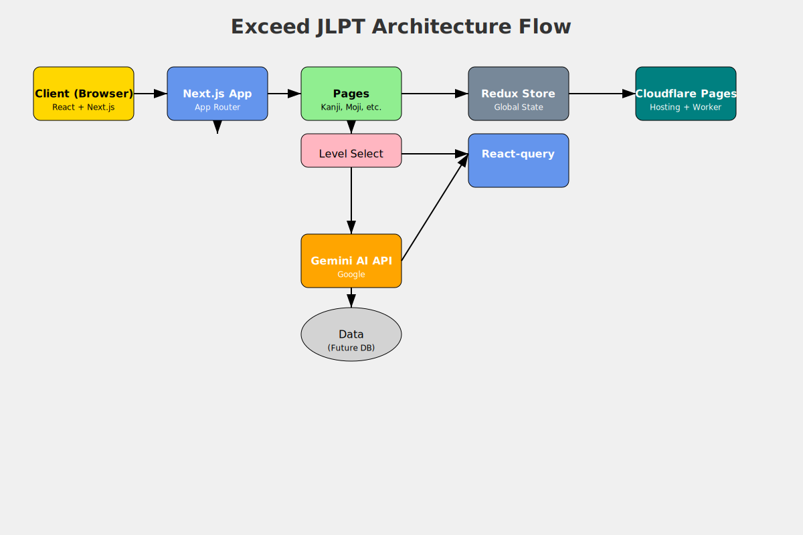
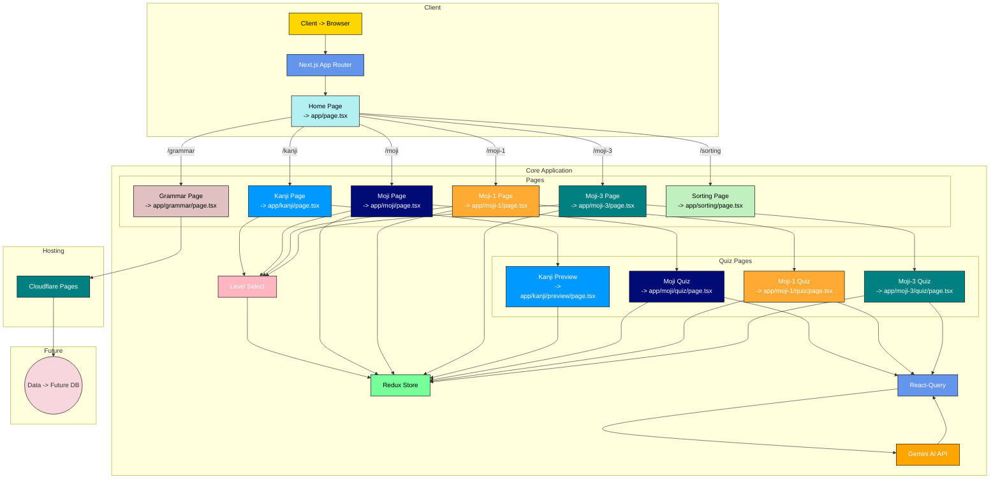

# Exceed JLPT

This project is a set of interactive JLPT (Japanese Language Proficiency Test) quizzes designed to help learners master various aspects of the Japanese language. It covers Kanji, Grammar, Vocabulary, and Pronunciation, providing a comprehensive learning experience.

## Architecture

## Project Presentation

### What is Exceed JLPT?

Exceed JLPT is a web application built to assist individuals in their journey to learn and master the Japanese language, specifically targeting those preparing for the JLPT exam.  It offers a variety of interactive quizzes, covering crucial areas such as:

*   **Kanji (漢字):** Test and reinforce your knowledge of Japanese characters.
*   **Grammar (文法):** Practice and understand Japanese grammatical structures.
*   **Vocabulary (語彙):** Expand your Japanese vocabulary with engaging exercises.
*   **Pronunciation (文字(発音)):** Focus on reading and correctly pronuncing.
*   **Words(文字(単語))**: Focus on understanding and using words.

### Key Features

*   **Interactive Quizzes:** The core of the application is its diverse set of quizzes, designed to be engaging and effective.
*   **Level Selection:** Users can choose their proficiency level (N5-N1) to tailor the difficulty.
*   **Gemini AI Integration:**  The quizzes are powered by Google's Gemini AI, ensuring dynamic and challenging questions.
*   **Detailed Feedback:** Users receive explanations and translations for each question.
*   **Progress Tracking:** (Future feature) Users will be able to track their progress and identify areas for improvement.
* **Responsive Design**: The application is designed to work on different screen size.

### How It Works

1.  **Choose a Category:** Select from Kanji, Grammar, Vocabulary, or Pronunciation.
2.  **Select a Level:** Choose your JLPT level (N5, N4, N3, N2, or N1).
3.  **Start the Quiz:** Begin the interactive quiz session.
4.  **Answer Questions:** Test your knowledge with multiple-choice questions.
5.  **Get Feedback:** View detailed explanations and translations after answering each question.
6. **Next Questions**: Get next questions and keep learning.

## Cloudflare Workers -> Pages

由于 Workers 有构建文件（zip）大小限制（3M），随着开发的进行，Node.js 的依赖包用的也会越多。可预期的未来里，非常容易超过这个限制。所以，需要将 Workers 部署到 Pages 上。

## 各页面 Header 组件(SVG shape generator)

### tool

- https://getwaves.io/
- https://www.svgbackgrounds.com/elements/svg-shape-dividers/
- https://svgwave.in/
- https://app.haikei.app/
- https://www.svgshapes.in/

### 🌟 SVG Path Editor

https://yqnn.github.io/svg-path-editor/

## Framer-motion 动画集

- https://framermotionexamples.com/examples?s=line_drawing

## Cloudflare Workers

``dev`` 推送时会触发 Github action 自动构建并部署到 Cloudflare Workers Preview 环境。

``main`` 推送时会触发 Cloudflare Workers Deployment，即 CF 的构建部署。

## Wrangler Configuration

https://developers.cloudflare.com/workers/wrangler/configuration/